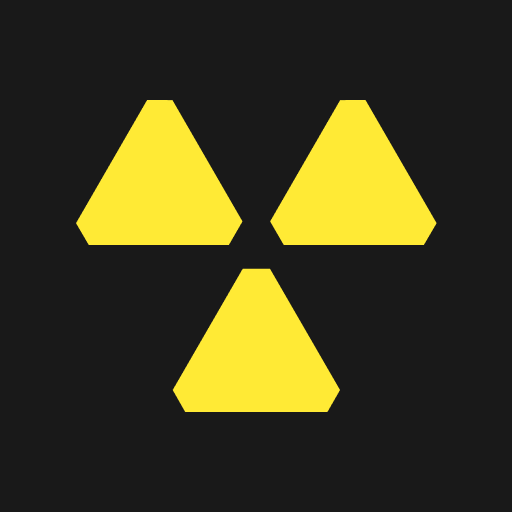

<p align="center">
  <a href="https://github.com/ngxyzaudax/radiacode-spectrum-rust">
    
  </a>
</p>

<h1 align="center">Radiacode Toolkit</h1>

<p align="center">
  Linux-first desktop software for <a href="https://www.radiacode.com/">RadiaCode</a> radiation detectors and spectrometers.
  <br />
  Connect over USB or Bluetooth LE — live readings, spectra, recordings, and device settings in one place.
</p>

<p align="center">
  <a href="https://www.rust-lang.org/"></a>
  <a href="LICENSE"></a>
  
  
</p>

<p align="center">
  <a href="#screenshots"><strong>Screenshots</strong></a>
  ·
  <a href="#quick-start"><strong>Quick start</strong></a>
  ·
  <a href="#architecture"><strong>Architecture</strong></a>
  ·
  <a href="#usb-access-on-linux"><strong>USB setup</strong></a>
</p>

---

## Screenshots

### Spectrum

<p align="center">
  
</p>

| | **Spectrum** |
| --- | --- |
| **Goal** | Inspect the live gamma spectrum from your detector — identify peaks, watch counts accumulate, and read calibrated energy on the fly. |
| **Features** | 1024-channel energy histogram · linear or log Y scale · adjustable smoothing · filled or outline chart style · live time, total counts, and calibration formula · reset accumulation |

### Spectrogram

<p align="center">
  
</p>

| | **Spectrogram** |
| --- | --- |
| **Goal** | See how the spectrum evolves over minutes or hours, capture sessions for later review, and manage a library of recordings. |
| **Features** | Time–energy waterfall · timed row capture with interval control · colormap palettes (Viridis, Inferno, Turbo) · grid, count-rate, and isotope-line overlays · searchable recording library · import, export, and replay `.rcspg` files |

### Analysis

<p align="center">
  
</p>

| | **Analysis** |
| --- | --- |
| **Goal** | Compare saved recordings side by side — pick a background, overlay samples, and spot differences that a single spectrum cannot show alone. |
| **Features** | Recording library with background / sample roles · multi-spectrum overlay chart · optional background subtraction · linear or log Y scale · smoothing · filled or outline chart style · per-recording metadata (live time, counts, serial) |

---

<p align="center"><sub>Other tabs — <strong>Monitor</strong> (live dose & count rates, trend charts, alarms) · <strong>Device</strong> (USB / Bluetooth connect) · <strong>Settings</strong> (thresholds, units, display, signals)</sub></p>

---

## Quick start

### Requirements

- Rust **1.85+**
- Linux with USB and/or Bluetooth as needed
- Build dependencies: `libusb` headers and OpenGL/EGL for the GUI

### Build and run

```bash
git clone git@github.com:ngxyzaudax/radiacode-spectrum-rust.git
cd radiacode-spectrum-rust
cargo build --release -p radiacode-spectrum
./target/release/radiacode-spectrum
```

Install to your PATH:

```bash
cargo install --path radiacode-spectrum
```

Optional desktop entry:

```bash
cp radiacode-spectrum/radiacode-spectrum.desktop ~/.local/share/applications/
```

---

## Architecture

Shared Rust crates sit behind the desktop app and handle protocol, transport, and device configuration.

| Crate | Role |
| --- | --- |
| `radiacode-spectrum` | Desktop application (egui) |
| `radiacode-core` | Device protocol, spectra, alarms, configuration |
| `radiacode-usb` | USB transport |
| `radiacode-bluetooth` | Bluetooth LE transport |

---

## USB access on Linux

RadiaCode USB devices use vendor `0483` / product `f123`. Without a udev rule, the app may not be able to open the device.

The app can install a rule when prompted. To install manually:

```bash
sudo cp radiacode.rules /etc/udev/rules.d/99-radiacode.rules
sudo udevadm control --reload
sudo udevadm trigger
```

Unplug and replug the detector after installing the rule.

---

<p align="center">
  <sub>Built for RadiaCode RC-1xx detectors · Linux-first · See <a href="LICENSE">LICENSE</a></sub>
</p>
