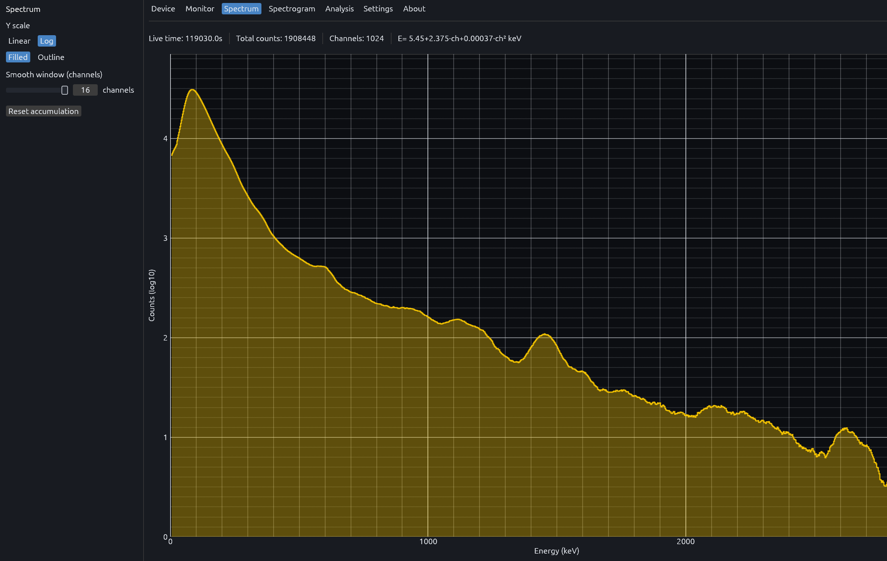
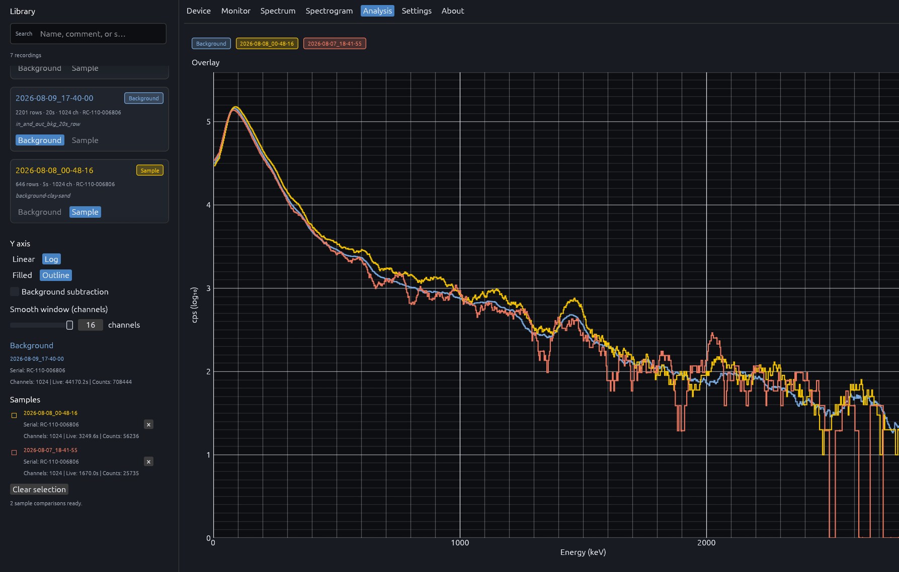

<p align="center">
  <a href="https://github.com/ngxyzaudax/radiacode-spectrum-rust">
    
  </a>
</p>

<h1 align="center">Radiacode Toolkit</h1>

<p align="center">
  Linux-first desktop software for <a href="https://www.radiacode.com/">RadiaCode</a> radiation detectors and spectrometers.
  <br />
  Connect over USB or Bluetooth LE — live readings, spectra, recordings, and device settings in one place.
</p>

<p align="center">
  <a href="https://www.rust-lang.org/"></a>
  <a href="LICENSE"></a>
  
  
</p>

<p align="center">
  <a href="#demo"><strong>Demo</strong></a>
  ·
  <a href="#screenshots"><strong>Screenshots</strong></a>
  ·
  <a href="#quick-start"><strong>Quick start</strong></a>
  ·
  <a href="#architecture"><strong>Architecture</strong></a>
  ·
  <a href="#usb-access-on-linux"><strong>USB setup</strong></a>
</p>

---

## Demo

<p align="center">
  
</p>

<p align="center">
  <a href="./docs/demo/radiacode_demo.webm">Full demo video (WebM, ~3:40)</a>
  ·
  <a href="./docs/README.md">Documentation index</a>
</p>

---

## Screenshots

Detailed notes for each tab live under [`docs/`](./docs/README.md).

### [Monitor](./docs/monitor/README.md)

<p align="center">
  <a href="./docs/monitor/README.md"></a>
</p>

Live dose rate, count rate, and session dose trends with alarm thresholds.

### [Spectrum](./docs/spectrum/README.md)

<p align="center">
  <a href="./docs/spectrum/README.md"></a>
</p>

Live 1024-channel energy histogram with calibrated keV axis.

### [Spectrogram](./docs/spectrogram/README.md)

<p align="center">
  <a href="./docs/spectrogram/README.md"></a>
</p>

Time–energy waterfall, recording transport, and `.rcspg` library.

### [Analysis](./docs/analysis/README.md)

<p align="center">
  <a href="./docs/analysis/README.md"></a>
</p>

Offline comparison of saved spectra with optional background subtraction.

### [Settings](./docs/settings/README.md)

<p align="center">
  <a href="./docs/settings/README.md"></a>
</p>

Device configuration: units, alarms, screen, and signal feedback.

---

## Quick start

### Requirements

- Rust **1.85+**
- Linux with USB and/or Bluetooth as needed
- Build dependencies: `libusb` headers and OpenGL/EGL for the GUI

### Build and run

```bash
git clone git@github.com:ngxyzaudax/radiacode-spectrum-rust.git
cd radiacode-spectrum-rust
cargo build --release -p radiacode-spectrum
./target/release/radiacode-spectrum
```

Install to your PATH:

```bash
cargo install --path radiacode-spectrum
```

Optional desktop entry:

```bash
cp radiacode-spectrum/radiacode-spectrum.desktop ~/.local/share/applications/
```

---

## Architecture

Shared Rust crates sit behind the desktop app and handle protocol, transport, and device configuration.

| Crate | Role |
| --- | --- |
| `radiacode-spectrum` | Desktop application (egui) |
| `radiacode-core` | Device protocol, spectra, alarms, configuration |
| `radiacode-usb` | USB transport |
| `radiacode-bluetooth` | Bluetooth LE transport |

---

## USB access on Linux

RadiaCode USB devices use vendor `0483` / product `f123`. Without a udev rule, the app may not be able to open the device.

The app can install a rule when prompted. To install manually:

```bash
sudo cp radiacode.rules /etc/udev/rules.d/99-radiacode.rules
sudo udevadm control --reload
sudo udevadm trigger
```

Unplug and replug the detector after installing the rule.

---

<p align="center">
  <sub>Built for RadiaCode RC-1xx detectors · Linux-first · See <a href="LICENSE">LICENSE</a></sub>
</p>
