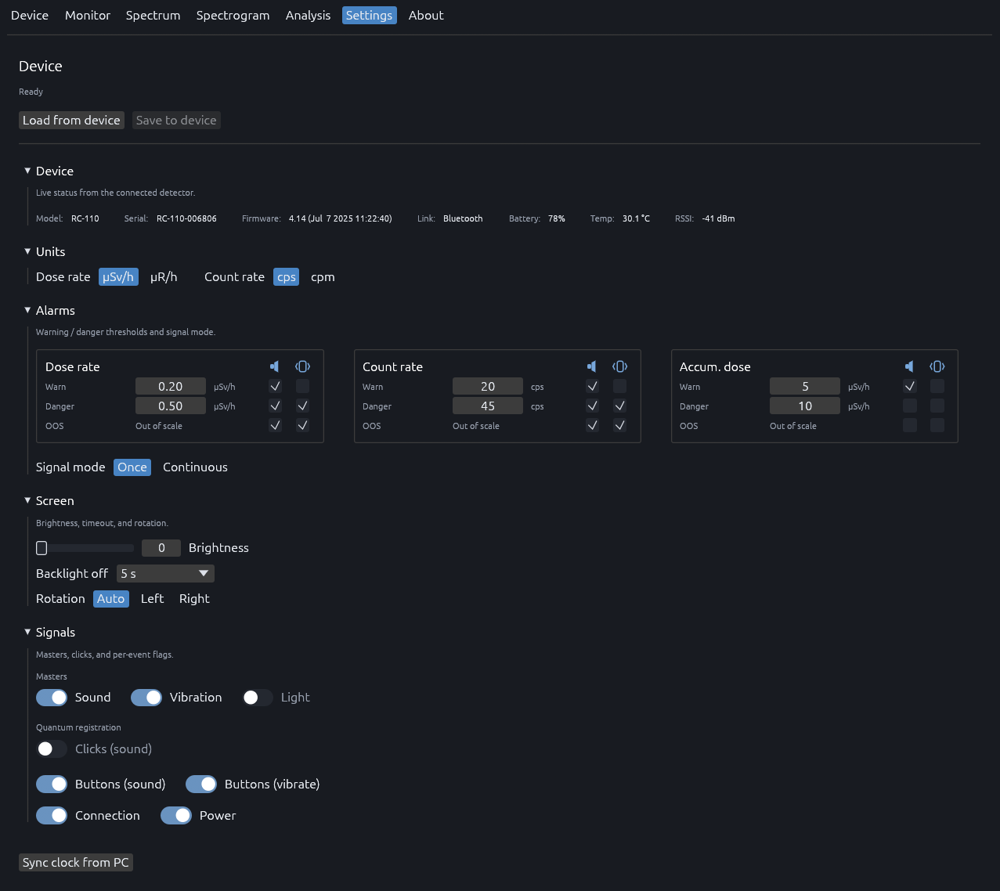

<p align="center">
  <a href="https://github.com/ngxyzaudax/radiacode-spectrum-rust">
    
  </a>
</p>

<h1 align="center">Radiacode Toolkit</h1>

<p align="center">
  Linux-first desktop software for <a href="https://www.radiacode.com/">RadiaCode</a> radiation detectors and spectrometers.
  <br />
  Connect over USB or Bluetooth LE — live readings, spectra, recordings, and device settings in one place.
</p>

<p align="center">
  <a href="https://www.rust-lang.org/"></a>
  <a href="LICENSE"></a>
  
  
</p>

<p align="center">
  <a href="#screenshots"><strong>Screenshots</strong></a>
  ·
  <a href="#quick-start"><strong>Quick start</strong></a>
  ·
  <a href="#architecture"><strong>Architecture</strong></a>
  ·
  <a href="#usb-access-on-linux"><strong>USB setup</strong></a>
</p>

---

## Screenshots

### Monitor

<p align="center">
  
</p>

The Monitor view is the primary operational dashboard for continuous radiation surveillance. It streams dose rate, count rate, and session-accumulated dose from the detector and plots each quantity as a rolling time series with warn and danger thresholds overlaid as reference lines. Numeric readouts and alarm configuration live in the sidebar so you can observe trends and adjust limits without switching context.

- Rolling **120 s** windows for dose rate and count rate; cumulative dose plotted over the full session
- Live readouts: dose rate, count rate, accumulated dose, session elapsed time (device-reported units)
- Alarm cards for dose rate, count rate, and accumulated dose — warn/danger thresholds, audible and visual toggles, load/save to device
- Filled or outline chart rendering; confirmed reset of accumulated dose on the detector

### Spectrum

<p align="center">
  
</p>

The Spectrum view displays the live 1024-channel energy histogram from the detector. It is intended for peak identification, calibration verification, and monitoring how counts accumulate in each channel over time. The energy axis is derived from the on-device calibration polynomial; live time, total counts, and the active formula are shown above the plot.

- 1024-channel histogram with calibrated energy axis (keV)
- Linear or logarithmic Y scale; adjustable smoothing window (channels)
- Filled or outline chart style; reset accumulation
- Header stats: live time, total counts, channel count, calibration coefficients

### Spectrogram

<p align="center">
  
</p>

The Spectrogram view captures how the energy spectrum changes over time. Each row is a snapshot taken at a configurable interval; rows stack into a time–energy waterfall for spotting drift, transient peaks, or environmental changes across long runs. A built-in library stores sessions on disk, supports search, and handles import/export of `.rcspg` recordings for offline review.

- Time–energy waterfall with configurable capture interval and row limit
- Colormap selection (Viridis, Inferno, Turbo); auto brightness, grid, count-rate, and isotope-line overlays
- Recording transport: record, pause, play, stop; live row count and history statistics
- Searchable recording library with metadata, comments, import, export, and replay

### Analysis

<p align="center">
  
</p>

The Analysis view compares saved spectrogram recordings offline. Assign one capture as background and one or more as samples, then overlay their spectra on a shared energy axis. Background subtraction highlights net peaks above ambient; smoothing and scale options match the live Spectrum view for consistent interpretation.

- Recording library with explicit **Background** / **Sample** role assignment
- Multi-spectrum overlay on a shared keV axis; optional background subtraction
- Linear or logarithmic Y scale (cps); adjustable smoothing; filled or outline charts
- Per-recording metadata: serial, channel count, live time, total counts

### Settings

<p align="center">
  
</p>

Settings is the configuration workspace for the detector and the desktop application. The Device section reads and writes on-device parameters over the active USB or Bluetooth link — units, alarm thresholds, display behaviour, haptic/audio feedback, and clock sync. Changes can be loaded from hardware, edited locally, and saved back in one workflow.

- **Device** — model, serial, firmware, link type, battery, temperature, RSSI
- **Units** — dose rate (µSv/h ↔ µR/h), count rate (cps ↔ cpm)
- **Alarms** — dose rate, count rate, and accumulated dose thresholds (warn / danger / OOS); per-level audible and vibration flags; once vs continuous signal mode
- **Screen** — brightness, backlight timeout, rotation (auto / left / right)
- **Signals** — master sound, vibration, and light toggles; clicks, button feedback, connection, and power alerts
- Load from device / save to device toolbar; sync clock from PC

---

## Quick start

### Requirements

- Rust **1.85+**
- Linux with USB and/or Bluetooth as needed
- Build dependencies: `libusb` headers and OpenGL/EGL for the GUI

### Build and run

```bash
git clone git@github.com:ngxyzaudax/radiacode-spectrum-rust.git
cd radiacode-spectrum-rust
cargo build --release -p radiacode-spectrum
./target/release/radiacode-spectrum
```

Install to your PATH:

```bash
cargo install --path radiacode-spectrum
```

Optional desktop entry:

```bash
cp radiacode-spectrum/radiacode-spectrum.desktop ~/.local/share/applications/
```

---

## Architecture

Shared Rust crates sit behind the desktop app and handle protocol, transport, and device configuration.

| Crate | Role |
| --- | --- |
| `radiacode-spectrum` | Desktop application (egui) |
| `radiacode-core` | Device protocol, spectra, alarms, configuration |
| `radiacode-usb` | USB transport |
| `radiacode-bluetooth` | Bluetooth LE transport |

---

## USB access on Linux

RadiaCode USB devices use vendor `0483` / product `f123`. Without a udev rule, the app may not be able to open the device.

The app can install a rule when prompted. To install manually:

```bash
sudo cp radiacode.rules /etc/udev/rules.d/99-radiacode.rules
sudo udevadm control --reload
sudo udevadm trigger
```

Unplug and replug the detector after installing the rule.

---

<p align="center">
  <sub>Built for RadiaCode RC-1xx detectors · Linux-first · See <a href="LICENSE">LICENSE</a></sub>
</p>
