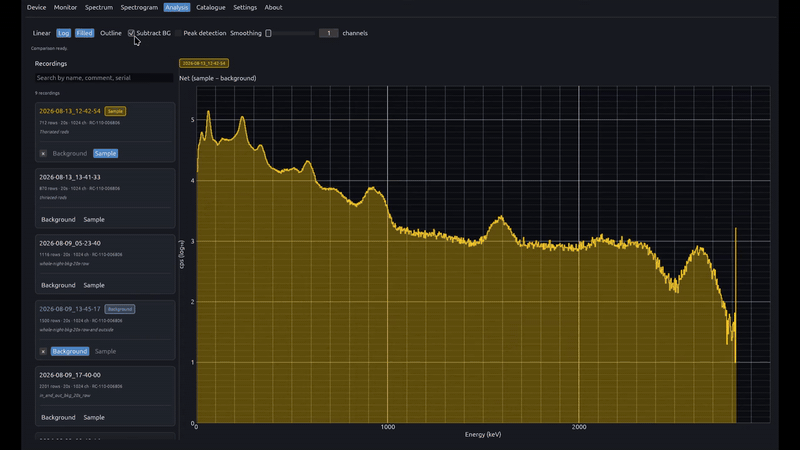

# Analysis

  

The Analysis view compares saved spectrogram recordings offline. Assign one capture as background and one or more as samples, then overlay their spectra on a shared energy axis. Background subtraction highlights net peaks above ambient; smoothing and scale options match the live Spectrum view for consistent interpretation.

## Features

- Recording library with explicit **Background** / **Sample** role assignment
- Multi-spectrum overlay on a shared keV axis; optional background subtraction
- Linear or logarithmic Y scale (cps); adjustable smoothing; filled or outline charts
- Per-recording metadata: serial, channel count, live time, total counts
- **Peak detection** on the collapsed comparison spectrum with nuclide identification chips

## Related

- [Spectrogram](../spectrogram/README.md)
- [Spectrum](../spectrum/README.md)
- [Catalogue](../catalogue/README.md)
- [Docs index](../README.md)
