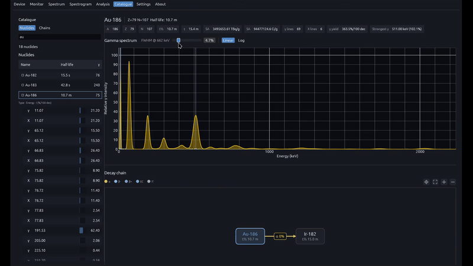

# Catalogue

  

The Catalogue tab is an offline reference for the bundled nuclide database. Browse individual isotopes or full decay chains, inspect gamma lines, and preview synthetic spectra at configurable resolution.

## Modes

### Nuclides

Search and filter the full catalogue. Select a nuclide to view:

- Identity and half-life statistics
- Gamma and X-ray line table with intensities
- Synthetic peak preview at the catalogue FWHM setting
- Decay chain graph with navigation into related members

### Chains

Browse natural decay series (U-238, U-235, Th-232, Np-237 and derived heads). Select a chain to view:

- Member list with equilibrium weights
- Combined chain spectrum preview
- Branching topology and line attribution

## Features

- Master–detail layout with collapsible filter pane
- Query search across symbol, name, and mass number
- Jump from Spectrum peak chips or chain overlays into the matching catalogue entry
- Nuclear data attribution footer (IAEA Livechart / ENSDF)

## Data

The catalogue ships inside `radiacode-nuclides` and is embedded at compile time. See [NUCLIDES.md](../NUCLIDES.md) for provenance, selection rules, and regeneration.

## Related

- [Spectrum](../spectrum/README.md)
- [Settings](../settings/README.md)
- [NUCLIDES.md](../NUCLIDES.md)
- [Docs index](../README.md)
