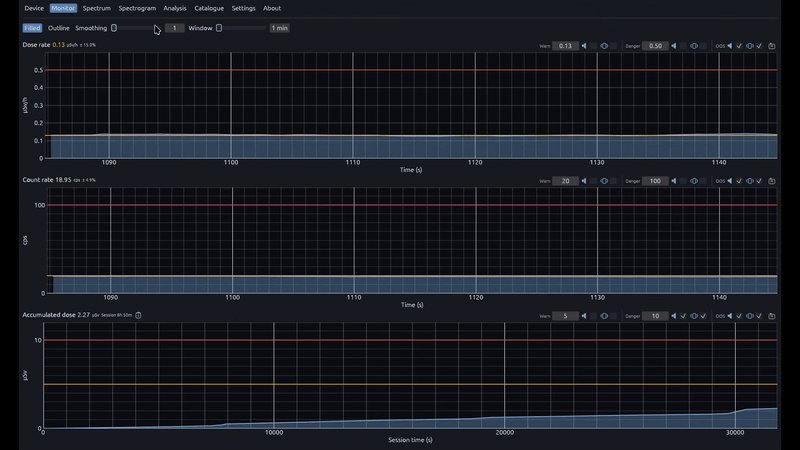

# Monitor

  

The Monitor view is the primary operational dashboard for continuous radiation surveillance. It streams dose rate, count rate, and session-accumulated dose from the detector and plots each quantity as a rolling time series with warn and danger thresholds overlaid as reference lines. Numeric readouts and alarm configuration live in the sidebar so you can observe trends and adjust limits without switching context.

After connecting on the **Device** tab the app opens here automatically.

## Features

- Configurable rolling window for dose rate and count rate (Settings → Application → Monitor window); cumulative dose plotted over the full session
- Live readouts: dose rate, count rate, accumulated dose, session elapsed time (device-reported units)
- Alarm cards for dose rate, count rate, and accumulated dose — warn/danger thresholds, audible and visual toggles, load/save to device
- Filled or outline chart rendering; confirmed reset of accumulated dose on the detector
- Optional PC alarm repeat when the detector enters warn or danger state

## Related

- [Device](../device/README.md)
- [Spectrum](../spectrum/README.md)
- [Settings](../settings/README.md)
- [Docs index](../README.md)
