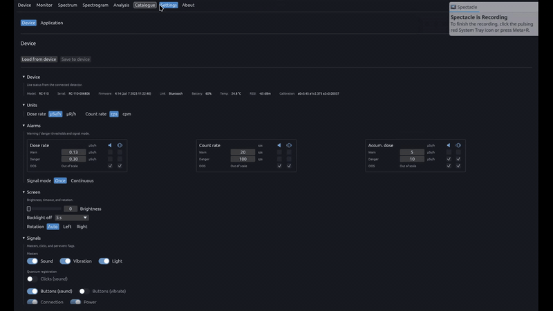

# Settings

  

Settings is the configuration workspace for the detector and the desktop application. The Device section reads and writes on-device parameters over the active USB or Bluetooth link — units, alarm thresholds, display behaviour, haptic/audio feedback, and clock sync. Changes can be loaded from hardware, edited locally, and saved back in one workflow.

## Device

- Live status chips: model, serial, firmware, link type, battery, temperature, RSSI, **calibration polynomial**
- **Units** — dose rate (µSv/h ↔ µR/h), count rate (cps ↔ cpm)
- **Alarms** — dose rate, count rate, and accumulated dose thresholds (warn / danger / OOS); per-level audible and vibration flags; once vs continuous signal mode
- **Screen** — brightness, backlight timeout, rotation (auto / left / right)
- **Signals** — master sound, vibration, and light toggles; clicks, button feedback, connection, and power alerts
- Load from device / save to device toolbar; sync clock from PC

## Application

Stored on this PC only. Changes save immediately.

- **Spectrogram capture** — interval, library folder, display options
- **Polling** — monitor and spectrum refresh intervals
- **Monitor window** — rolling time span for dose and count rate plots
- **Peak detection and identification** — sensitivity (σ), detector FWHM, match tolerance, minimum gamma intensity
- **Catalogue preview** — synthetic gamma spectrum resolution in the nuclide browser
- **Appearance** — UI scale
- **Connection** — remember last device, auto-connect on launch
- **PC alerts** — repeat detector alarms on this computer

## Related

- [Device](../device/README.md)
- [Monitor](../monitor/README.md)
- [NUCLIDES.md](../NUCLIDES.md)
- [Docs index](../README.md)
