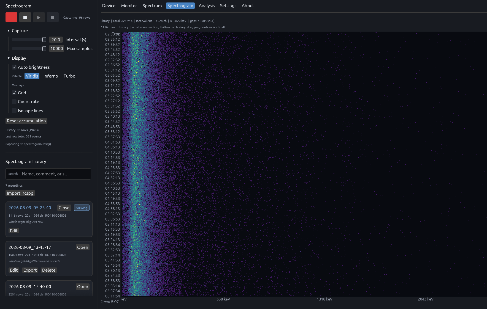

# Spectrogram

  

The Spectrogram view captures how the energy spectrum changes over time. Each row is a snapshot taken at a configurable interval; rows stack into a time–energy waterfall for spotting drift, transient peaks, or environmental changes across long runs. A built-in library stores sessions on disk, supports search, and handles import/export of `.rcspg` recordings for offline review.

## Features

- Time–energy waterfall with configurable capture interval and row limit
- Colormap selection (Viridis, Inferno, Turbo); auto brightness, grid, count-rate, and isotope-line overlays
- Recording transport: record, pause, play, stop; live row count and history statistics
- Searchable recording library with metadata, comments, import, export, and replay

## Related

- [Spectrum](../spectrum/README.md)
- [Analysis](../analysis/README.md)
- [Docs index](../README.md)
