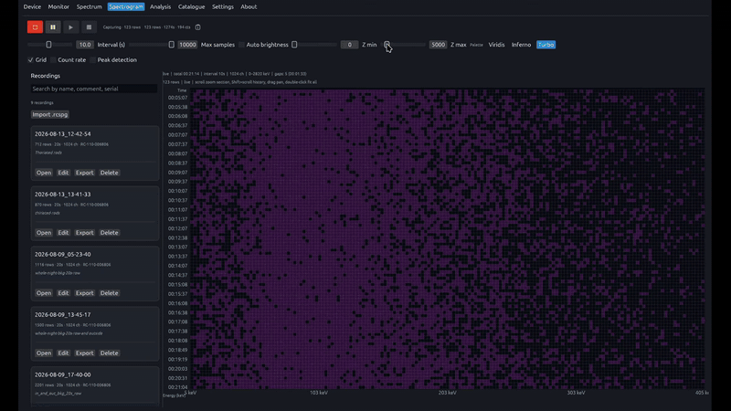

# Spectrogram

  

The Spectrogram view captures how the energy spectrum changes over time. Each row is a snapshot taken at a configurable interval; rows stack into a time–energy waterfall for spotting drift, transient peaks, or environmental changes across long runs. A built-in library stores sessions on disk, supports search, and handles import/export of `.rcspg` recordings for offline review.

## Features

- Time–energy waterfall with configurable capture interval and row limit
- **Spectrum preview strip** above the heatmap — whole-series sum aligned to visible energy columns, with **Lin/Log** scale and **Peaks** toggles in the left gutter
- Colormap selection (Viridis, Inferno, Turbo); auto brightness; always-on grid and count-rate sparkline (time labels left, count rate right)
- Recording transport: record, pause (recording only), resume, stop, and reset accumulation (`↺`); compact `hh:mm:ss · N rows` readout beside the controls
- Searchable recording library with metadata, comments, import, export, and replay
- **Peak detection** on the collapsed spectrum (all rows summed); markers and preview strip share column-aligned energy mapping
- **Sticky peak cursor** — with **Peaks** on, the vertical crosshair snaps to the nearest peak line within 12 px on the heatmap and preview strip; hover shows nuclide details plus cell readout
- Scroll wheel zooms energy at the pointer; drag pans time (vertical) and energy when zoomed in; double-click fits full spectrum
- Identified nuclide chips shared with the Spectrum overlay

## Related

- [Spectrum](../spectrum/README.md)
- [Compare](../compare/README.md)
- [Docs index](../README.md)
