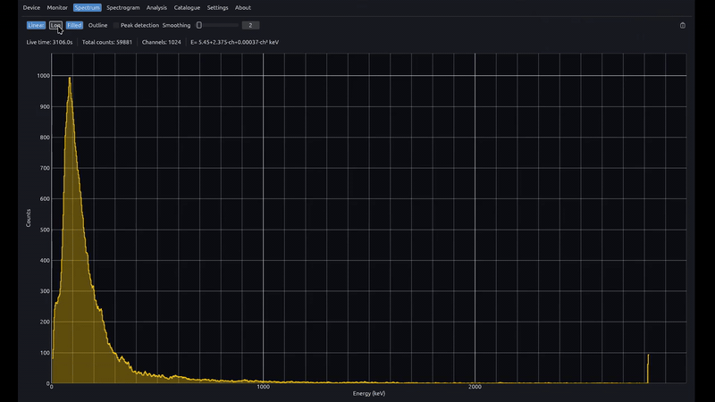

# Spectrum

  

The Spectrum view displays the live 1024-channel energy histogram from the detector. It is intended for peak identification, calibration verification, and monitoring how counts accumulate in each channel over time. The energy axis is derived from the on-device calibration polynomial; live time, total counts, and the active formula are shown above the plot.

## Features

- 1024-channel histogram with calibrated energy axis (keV)
- Linear or logarithmic Y scale; adjustable smoothing window (channels)
- Filled or outline chart style; reset accumulation
- Header stats: live time, total counts, channel count, calibration coefficients
- **Peak detection** — SNIP continuum removal, matched-filter peaks, Poisson significance; toggle on the toolbar
- Identified nuclide chips on detected peaks; click to open the matching catalogue entry
- Resolution-aware matching using detector FWHM (Settings → Application → Peak detection and identification)

## Related

- [Catalogue](../catalogue/README.md)
- [Spectrogram](../spectrogram/README.md)
- [Analysis](../analysis/README.md)
- [NUCLIDES.md](../NUCLIDES.md)
- [Docs index](../README.md)
